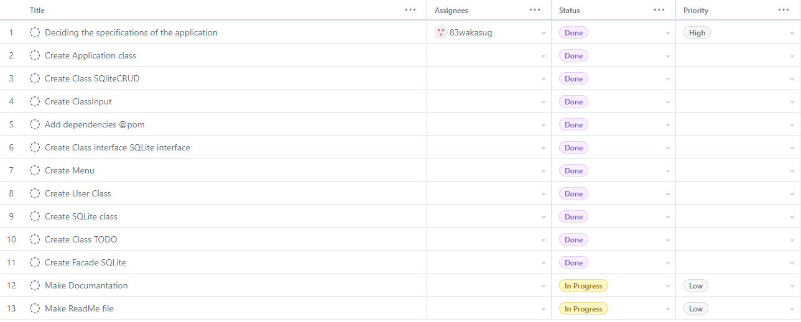
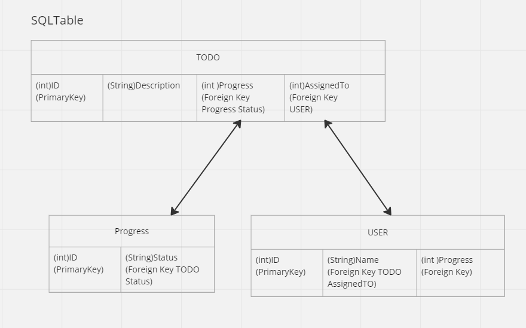

# Wakana Sugihara

## Egna reflektioner

### Skapa TODO Application

Skapa ett program som kan hantera TODO. 
Programet kan även registrera progress och ansvarig för tasks. 
Alla data kan lägga,radera uppdatera, och ta bort. 

### Vad du har gjort
Planerade hur application fungerar och alla straktur för koden. 
Skapa test för coden. 
Försökte undvika hårda code så mycket som möjligt. 
Försökte dela upp klasser så mycket som möjligt. 
Försökte att undvika upprepning men det misslyckades jag. 

## Planering
Jag började planera hur programet bete sig. 
Sen bestämde jag vilka databasen jag kommer använda och detta strakturen. 
Tillslut planerade jag hur jag delar upp klasser och methoder. 

### Lösningsförslag innan uppgiften påbörjas

#### Skisser (exempelvis)

#### Hur du tänker försöka lösa uppgiften
  

#### Diagram

### Jira/Trello/Github Project och projekthantering enligt Scrum/Kanban

## Arbetet och dess genomförande

### Vad som varit svårt

### Beskriv lite olika lösningar du gjort

### Beskriv något som var besvärligt att få till

### Beskriv om du fått byta lösning och varför i sådana fall

## Reflektion & Slutsatser

### Vad gick bra

### Vad gick dåligt

### Vad har du lärt dig

### Vad hade ni gjort annorlunda om ni gjort om projektet

### Vilka möjligheter ser du med de kunskaper du fått under kursen.
